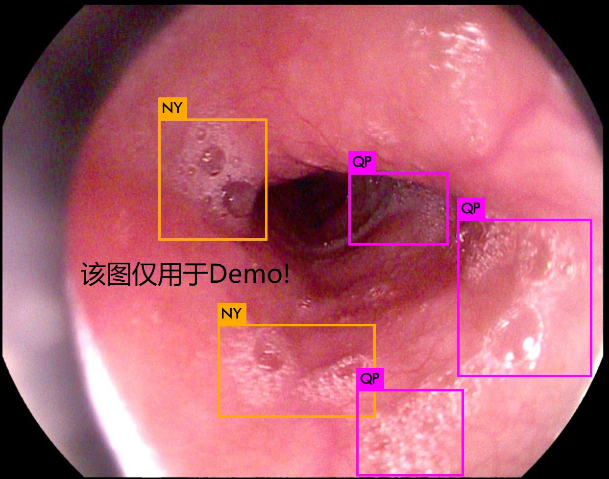

## [DIoU-Darknet](https://github.com/Zzh-tju/DIoU-darknet) 训练目标检测任务的过程

> YOLOv3 with DIoU and CIoU losses implemented in Darknet

[[arxiv](https://arxiv.org/abs/1911.08287)] [[pdf](https://arxiv.org/pdf/1911.08287.pdf)]

**Xu Jing**

配置和训练过程以darknet版YOLO v3和Gaussian YOLO v3的配置训练过程相似，这里以Ubuntu为例，关于Windows下的配置和生成过程，具体可以联系[**DataXujing**](https://github.com/DataXujing)

### 1.修改Makefile并make

```shell
GPU=1 #如果使用GPU设置为1，CPU设置为0
CUDNN=1  #如果使用CUDNN设置为1，否则为0
OPENCV=1 #如果调用摄像头，还需要设置OPENCV为1，否则为0
OPENMP=1  #如果使用OPENMP设置为1，否则为0
DEBUG=0  #如果使用DEBUG设置为1，否则为0
```

```shell
make
```


### 2.数据

VOC格式数据！


### 3.配置文件

+ (1).Losses

目前支持的损失：`[iou|giou|diou|ciou|mse]`

```
iou_loss=ciou
```
+ (2).Normalizers

Location和Claffication损失之间的Normalize,`cls_normalizer` 和`iou_normalizer` 默认都是`1.0`,但在DIoU探索中发现，下面的配置比较好：

```
iou_loss=diou
cls_normalizer=1
iou_normalizer=1.0
```
```
iou_loss=ciou
cls_normalizer=1
iou_normalizer=0.5
```

+ (3).DIoU-NMS


在`nms_kind`参数下设置，目前支持`[greedynms|diounms]`

```
nms_kind=greedynms
```
```
nms_kind=diounms
```

对于YOLOv3来说, DIoU-NMS中引入beta1参数： `DIoU = IoU - R_DIoU ^ {beta1}`,是的NMS表现不错。DIoU发现，对于YOLOv3

```
beta1=0.6
```

DIoU-NMS是比较好的(bet1=1.0也优于greedy-NMS)。但对于SSD和Faster R-CNN而言，`beta1=1.0`就很不错了。


+ (4).learning rate

    - `learning_rate`的设置原则 `NEW_RATE = ORIGINAL_RATE * 1/NUMBER_OF_GPUS` ；  

    - `burn_in` 的设置原则 `NEW_BURN_IN = ORIGINAL_BURN_IN * NUMBER_OF_GPUS`

因此对于1个GPU的情形：

```
    learning_rate=0.001
    burn_in=1000
```

对于2个GPU的情形:

```
    learning_rate=0.0005
    burn_in=2000
```

对于4个GPU的情形:

```
    learning_rate=0.00025
    burn_in=4000
```

+ (5).其他配置

其他配置和YOLOv3相似！


### 4.训练

```
./darknet detector train cfg/myData-diou.data cfg/myData-diou.cfg darknet53.conv.74 #-gpus 0,1
```

### 5.Evaluation

```
./darknet detector test cfg/myData.data cfg/myData-ciou.cfg backup/ciou/myData-ciou_14000.weights data/test1.jpg
```

### 6.DEMO




### Reference

```
@inproceedings{zheng2020distance,
  author    = {Zhaohui Zheng, Ping Wang, Wei Liu, Jinze Li, Rongguang Ye, Dongwei Ren},
  title     = {Distance-IoU Loss: Faster and Better Learning for Bounding Box Regression},
  booktitle = {The AAAI Conference on Artificial Intelligence (AAAI)},
   year      = {2020},
}
```
